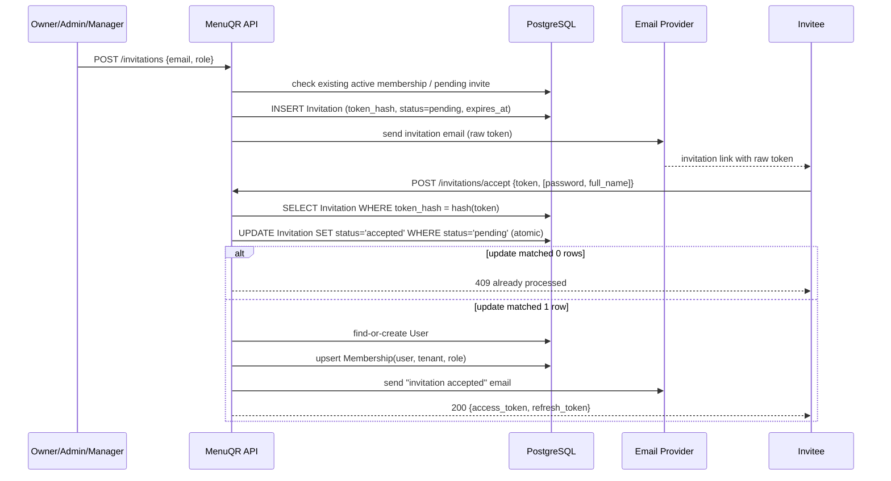

# Invitation flow

## Diagram

## Concurrency / race-condition protection

Two browser tabs (or a malicious replay) could submit
`POST /invitations/accept` with the same token at nearly the same moment.
`invitation_service.accept_invitation` guards against a double-accept two
ways:

1. **Atomic conditional update**: the transition from `pending` to `accepted`
   is done with `UPDATE invitations SET status='accepted' ... WHERE id = :id
   AND status = 'pending'`, executed as a single statement. Whichever request
   reaches Postgres first "wins" the row; the loser's `UPDATE` matches zero
   rows (Postgres row-level locking serializes the two concurrent
   transactions), and the code checks `result.rowcount == 0` to detect this
   and abort with `409 RESOURCE_CONFLICT` instead of creating a duplicate
   membership.
2. **Unique constraint** on `memberships (user_id, tenant_id)` as a second,
   independent guard — even if the status check were somehow bypassed, the
   database itself refuses a second membership row for the same
   user+tenant pair.

## Other flows

- **Duplicate invitations**: a unique constraint
  `uq_invitation_tenant_email_status` on `(tenant_id, email, status)` combined
  with an application-level check means a second `POST /invitations` for an
  email that already has a `pending` invitation in the same tenant returns
  `409`.
- **Already a member**: inviting an email that already has an active
  membership in the tenant returns `409` before any invitation row is created.
- **Expired token**: `accept_invitation` checks `expires_at` and, if expired,
  marks the invitation `expired` and returns `422` rather than silently
  succeeding.
- **Revoked/used token**: both return `422` with a specific message; a
  revoked invitation cannot be resent or accepted, only left as-is (a new
  invitation must be created).
- **Resend**: issues a brand-new raw token (and hash) and a new
  `expires_at`, invalidating the old token immediately (its hash no longer
  matches any current `token_hash`).
- **Role validation**: inviting someone as `owner` is rejected outright
  (`400`); ownership is only ever established at registration.
- **Tenant isolation**: invitation IDs are looked up scoped to
  `Invitation.tenant_id == ctx.tenant_id` for every resend/revoke/list
  operation.

Tested in `tests/api/test_invitations.py`.
